# Data Engineering Zoomcamp 2026 - Module 2 Homework

## Step 1: Infrastructure Setup
In this step, the core orchestration and database environment was established using Docker Compose.

### 🛠 Execution Commands
To initiate the environment, run the following commands in your terminal:

```bash

# Start all services in detached mode
docker compose up -d

# Check container status
docker compose ps

CONTAINER ID   IMAGE                COMMAND                  CREATED          STATUS                    PORTS                                                             NAMES
c4aa77b0cf49   dpage/pgadmin4       "/entrypoint.sh"         58 minutes ago   Up 58 minutes             0.0.0.0:8085->80/tcp, [::]:8085->80/tcp                           homework02-pgadmin-1
5301aeb58a5c   postgres:18          "docker-entrypoint.s…"   58 minutes ago   Up 58 minutes             0.0.0.0:5432->5432/tcp, [::]:5432->5432/tcp                       homework02-pgdatabase-1
8ec9dea12e54   kestra/kestra:v1.1   "docker-entrypoint.s…"   58 minutes ago   Up 58 minutes             0.0.0.0:8080-8081->8080-8081/tcp, [::]:8080-8081->8080-8081/tcp   homework02-kestra-1
e4e66fff520c   postgres:18          "docker-entrypoint.s…"   58 minutes ago   Up 58 minutes (healthy)   5432/tcp                                                          homework02-kestra_postgres-1

### Services:
* **Kestra (v1.1):** Workflow orchestrator (Port: 8080)
* **Postgres (NY Taxi):** Destination database for taxi data (Port: 5432)
* **Postgres (Kestra):** Internal database for Kestra metadata
* **pgAdmin:** Database management UI (Port: 8085)

### Verification:
- [ ] Kestra UI accessible at http://localhost:8080
- [ ] pgAdmin accessible at http://localhost:8085
- [ ] Docker containers are healthy and running.

Kestra UI accessible at http://localhost:8080 (Login: admin@kestra.io / Admin1234!)
pgAdmin accessible at http://localhost:8085 (Login: admin@admin.com / root)

## 🏁 Step 2: First Flow Deployment (Hello World)
Testing the orchestration engine with the basic `01_hello_world` flow to verify task execution and variable handling.

### 🛠 Actions:
1. Created a new flow in the `zoomcamp` namespace.
2. Verified the following Kestra concepts:
   - **Inputs:** Runtime parameters.
   - **Variables:** Reusable strings within the flow.
   - **Tasks:** Sequential steps (Log, Sleep, Return).
   - **Triggers:** Scheduled execution (Cron: `0 10 * * *`).

### 🔍 Verification:
- [x] Flow saved successfully.
- [x] Execution finished with status **SUCCESS**.
- [x] Logs verified for the message: "Hello, Zoomcamper!"

## 🏁 Step 2: First Flow Deployment (Hello World)
Testing the orchestration engine with the basic `01_hello_world` flow.

### ⚠️ Troubleshooting & Resolution
- **Validation Error:** `Invalid type: io.kestra.plugin.core.debug.Sleep`
- **Root Cause:** Kestra v1.1 update changed core plugin paths.
- **Fix:** - Updated `sleep` task type to `io.kestra.plugin.core.flow.Sleep`.
  - Fixed syntax error on line 18 where `type:` was duplicated.

### 🔍 Execution Results
The flow was executed successfully with all tasks returning a green status.

| Task ID | Type | Duration | Result |
| :--- | :--- | :--- | :--- |
| log_message | core.log.Log | 0.49s | ✅ SUCCESS |
| sleep | core.flow.Sleep | 2.03s | ✅ SUCCESS |
| return_message | core.debug.Return | 0.03s | ✅ SUCCESS |
| log_output | core.log.Log | 0.01s | ✅ SUCCESS |

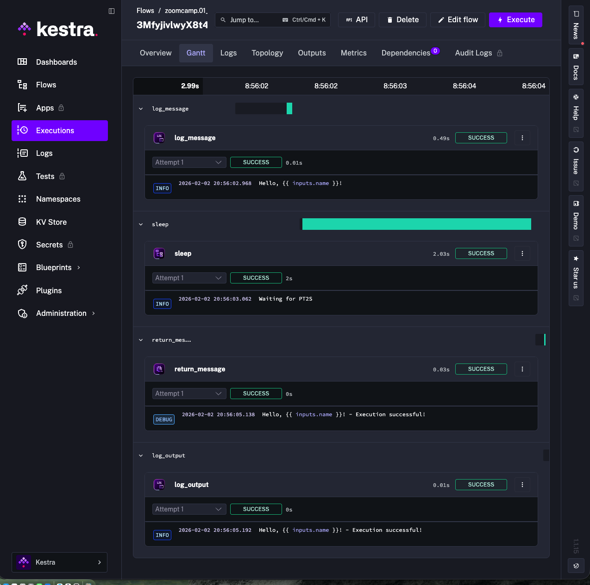
*(Note: Success verified in Kestra UI at 20:56:05)*


## 🐍 Step 3: Orchestrating Python Scripts
Successfully integrated a Python script that runs within a dedicated Docker container to fetch external data from Docker Hub.

### 🛠 Actions:
1. Created `02_python.yaml` using the `io.kestra.plugin.scripts.python.Script` task type.
2. Utilized `io.kestra.plugin.scripts.runner.docker.Docker` as the task runner with `python:slim` image.
3. Implemented `requests` and `kestra` libraries to handle API calls and internal outputs.

### 🔍 Execution Results:
The flow was executed successfully. Kestra successfully managed the Docker lifecycle (pulling the image, running the script, and capturing outputs).

| Metric | Value |
| :--- | :--- |
| **Status** | ✅ SUCCESS |
| **Duration** | 1m 4.79s |
| **Namespace** | zoomcamp |
| **Flow ID** | 02_python |

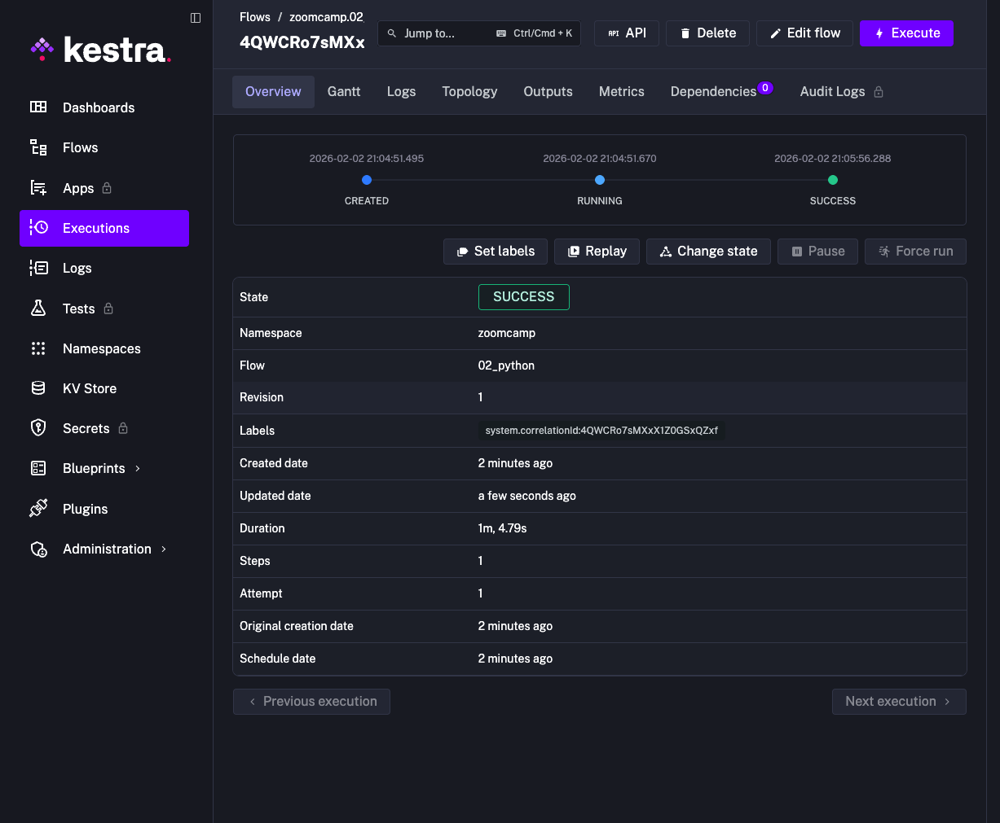

*(Note: Verified that image pull counts were captured in the Outputs tab.)*

## 📊 Step 4: Getting Started Data Pipeline
Successfully executed an introductory ETL pipeline to demonstrate data movement and in-memory processing.

### 🛠 Actions:
1. Deployed `03_getting_started_data_pipeline.yaml` which integrates HTTP, Python, and DuckDB.
2. **Extract:** Downloaded product data from a REST API (`dummyjson.com`).
3. **Transform:** Processed the JSON data using an internal Python script.
4. **Query:** Executed a DuckDB SQL query to calculate average prices by brand.

### 🔍 Execution Results:
The flow completed successfully, proving that Kestra can handle complex multi-step orchestrations with different tools.

| Task ID | Type | Duration | Result |
| :--- | :--- | :--- | :--- |
| **extract** | core.http.Download | 0.90s | ✅ SUCCESS |
| **transform** | script.python.Script | ~10s | ✅ SUCCESS |
| **query** | plugin.jdbc.duckdb.Query | 3.02s | ✅ SUCCESS |

#### Execution Proof:
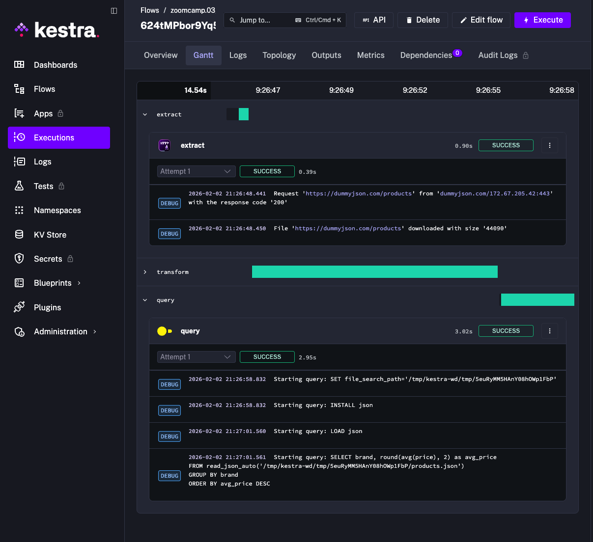
*(Note: Verified average price calculation in the query logs.)*

## 🚖 Step 5: Loading Taxi Data to Local Postgres
Successfully executed the primary ETL pipeline to ingest NYC Taxi data into the local `ny_taxi` database.

### 🛠 Actions:
1. Deployed and configured `04_postgres_taxi.yaml` to point to the `pgdatabase` service.
2. **Execution Parameters:** - **Taxi:** Yellow
   - **Year:** 2019
   - **Month:** 01
3. **Internal Process:** Kestra successfully handled CSV extraction, table creation, staging, and final merging into the production table.

### 🔍 Execution Results:
The flow completed in **8 minutes and 10 seconds**, demonstrating stable performance on macOS.

| Metric | Value |
| :--- | :--- |
| **Status** | ✅ SUCCESS |
| **Duration** | 8m 10s |
| **Flow ID** | 04_postgres_taxi |

#### Execution Proof:
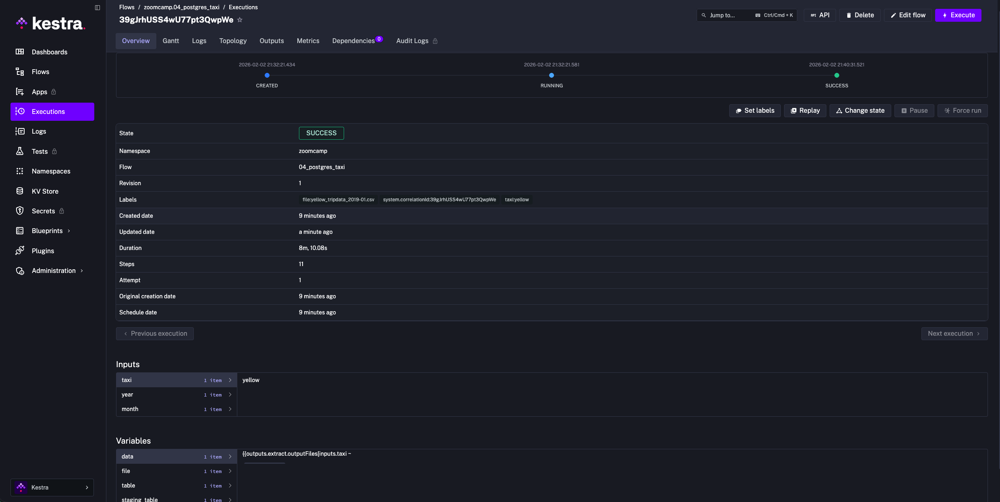

## ⏰ Step 6: Scheduling and Backfills
In this final phase of the local setup, I implemented automated scheduling and performed a complete historical data backfill for the Green Taxi 2019 dataset.

### 🛠 Actions Taken:
1. **Automated Triggering:** Deployed `05_postgres_taxi_scheduled.yaml` with a daily 9 AM UTC schedule.
2. **Strategy Shift:** Performed a "Clean Reset" by deleting failed manual executions to resolve variable scope issues (`trigger.date`).
3. **Backfill Operation:** - Initiated via the **Triggers** tab using the **Backfill executions** feature.
   - **Range:** January 2019 to December 2019.
   - **Target:** Green Taxi dataset.

### 🔍 Results & Verification:
The orchestration engine successfully processed all 12 months in parallel/sequence, ensuring data consistency in the local Postgres instance.

| Month | Dataset | Status |
| :--- | :--- | :--- |
| 2019-01 to 2019-12 | Green Taxi | ✅ SUCCESS |

#### Execution Proof:
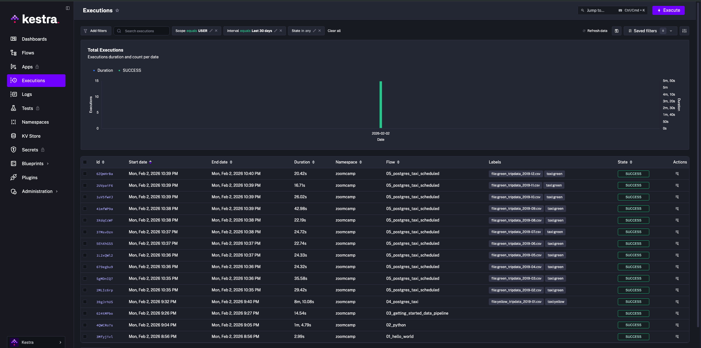
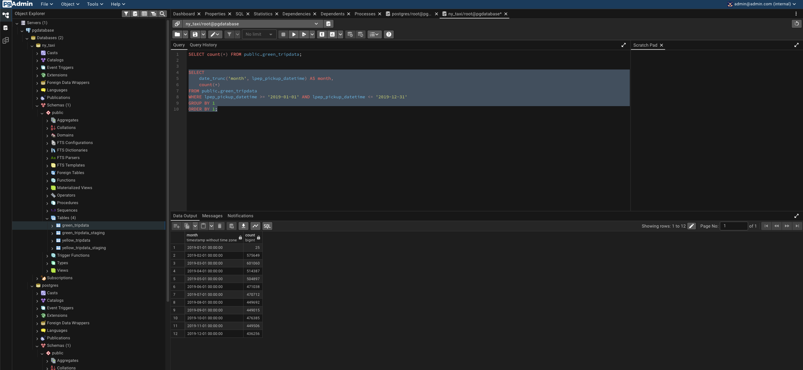
*(Note: Verified that each monthly execution correctly populated the `trigger.date` variable.)*

## ☁️ Step 8: Cloud Migration - ETL to ELT (GCP)
Shifting the data processing strategy from local ETL to Cloud-native ELT using Google Cloud Platform.

### 🏗 Architecture Transition:
- **Data Lake:** Google Cloud Storage (GCS) will store raw CSV files.
- **Data Warehouse:** BigQuery will act as the compute engine for transformations.
- **Shift to ELT:** By loading data before transforming, we leverage BigQuery's massive parallel processing capabilities for large datasets like Yellow Taxi.

### 🔍 Key Benefits:
- **Performance:** Cloud infrastructure handles large-scale transformations significantly faster than local machines.
- **Scalability:** Easily manage hundreds of millions of rows without memory bottlenecks.


## ☁️ Step 9: GCP Service Account & Policy Configuration
Establishing secure authentication between Kestra and Google Cloud Platform while bypassing organizational restrictions.

### 🛠️ IAM & Key Generation
- **Service Account:** Created `kestra-runner` to manage cloud-native operations.
- **Roles Assigned:** Granted `Storage Admin`, `BigQuery Admin`, and `Owner` permissions to ensure full pipeline functionality.

### 🛡️ Resolving "iam.disableServiceAccountKeyCreation" Constraint
Encountered a root-level policy blocking JSON key creation. Solved via:
- **Privilege Elevation:** Assigned `Organization Policy Administrator` role to the user at the organization level.
- **Policy Override:** Modified the `iam.disableServiceAccountKeyCreation` constraint using the "Override parent's policy" feature and setting "Policy enforcement" to **OFF**.
- **Outcome:** Successfully generated and downloaded the Service Account JSON key.

---

## 🔐 Step 10: Secrets Management & Docker Integration
Integrating the GCP credentials into the local Kestra instance securely using environment variables.

### 🏗️ Implementation Workflow:
- **Base64 Encoding (macOS):** Encoded the JSON key into a Base64 string to be passed as an environment variable:
  ```bash
  base64 -i [gcp-key-file].json | pbcopy
  ```
- **Docker Compose Configuration:** Updated the `kestra` service environment in `docker-compose.yml`:
  ```yaml
    services:
      kestra:
        environment:
          SECRET_GCP_CREDS: "your_base64_encoded_json_here"
  ```
- **System Stability:** Resolved `Port 8080 already allocated` errors by identifying ghost processes with `lsof -i :8080` and performing a clean `docker compose down --remove-orphans`.

---

## 🚀 Step 11: Verified Cloud Orchestration
Deployment of the first cloud-native pipeline.

### 📂 Flow: GitHub Ingestion to GCS
- **Logic:** Orchestrated a flow to download compressed NYC Taxi data (.gz) from GitHub and stream it directly to the GCS Bucket.
- **Authentication:** Verified that the `SECRET_GCP_CREDS` variable is correctly decrypted and utilized by Kestra's GCP plugins.
- **Result:** Confirmed raw data delivery to `kestra-zoomcamp-486219-bucket`.

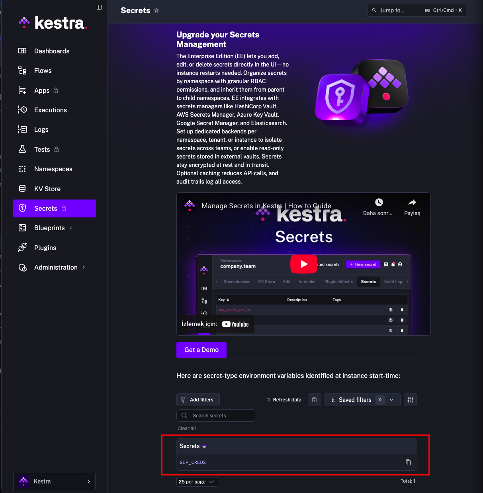

## ⚙️ Step 12: Initializing Global Metadata (KV Store)
To ensure our pipelines are modular and avoid hardcoding sensitive or project-specific values, we utilize Kestra's Key-Value (KV) Store.

### 🛠️ Implementation & Configuration:
- **Flow Execution:** Successfully ran `06_gcp_kv.yaml` to register our GCP environment constants globally within the Kestra namespace.
- **Metadata Injected:**
  - `GCP_PROJECT_ID`: `kestra-zoomcamp-486219`
  - `GCP_LOCATION`: Assigned based on existing infrastructure (e.g., US or EU).
  - `GCP_BUCKET_NAME`: Linked to our pre-provisioned GCS bucket.
  - `GCP_DATASET`: Set to `zoomcamp` for BigQuery transformations.

### 🔍 Verification:
After execution, all variables are visible and manageable under the **KV Store** tab in the Kestra UI, allowing any future flow to reference them using the `{{kv('KEY_NAME')}}` syntax.
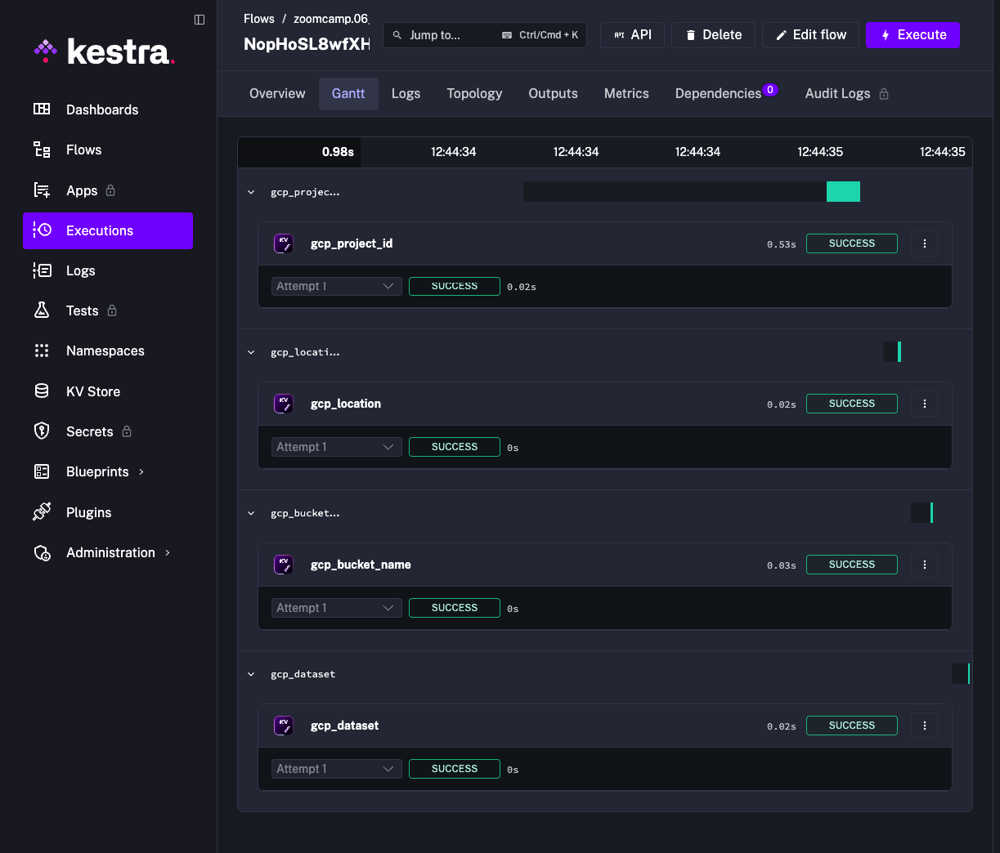
*Screenshot description: Successful execution of flow 06_gcp_kv and the resulting key-value pairs in the KV Store dashboard.*

## 🏛️ Step 13: Infrastructure Synchronization & Verification
This phase ensured that the orchestration layer (Kestra) is perfectly aligned with the cloud infrastructure (GCP).
### 🛠️ Implementation Workflow:
- **Global Metadata Initialization:** Executed `06_gcp_kv.yaml` to store environment constants such as `GCP_PROJECT_ID`, `GCP_LOCATION`, and `GCP_BUCKET_NAME` in the Kestra KV Store.
- **Idempotent Resource Setup:** Ran `07_gcp_setup.yaml` to synchronize the Data Lake and Data Warehouse components.
  - **GCS Bucket:** The task successfully identified that the bucket `kestra-de-zoomcamp-mdenizli` already existed. Using the `ifExists: SKIP` logic, it maintained the existing resource without errors.
  - **BigQuery Dataset:** Successfully provisioned the `zoomcamp` dataset within the target project.

### 🔍 Technical Evidence & Validation:
- **Authentication:** Verified `GCP_CREDS` as a secure, environment-backed secret within the Kestra instance.
- **Regional Alignment:** Confirmed that both GCS and BigQuery are co-located in the `us-east1` (South Carolina) region to optimize data transfer performance and minimize cross-region latency.

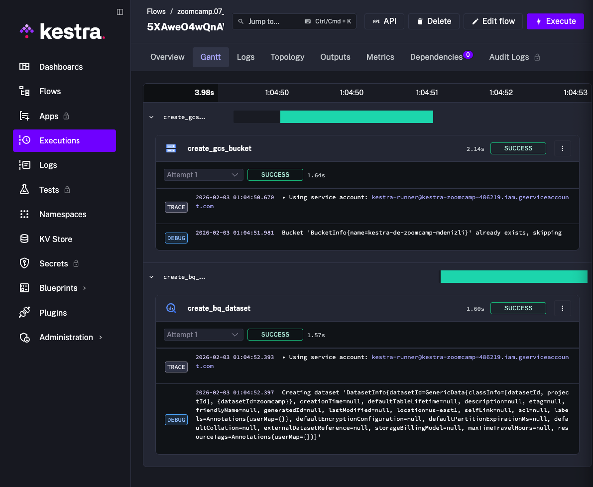
*Caption: Successful automated setup showing the creation of the BigQuery dataset and verification of the pre-existing GCS bucket.*


## 🚀 Step 14: GCP Workflow - Loading Taxi Data to BigQuery
Finalizing the "Load" phase of the ELT strategy by migrating NYC Taxi data from local/GitHub sources to the Google Cloud environment.

### 🏗️ Execution Highlights:
- **Data Ingestion:** Successfully downloaded raw taxi data and streamed it to the verified GCS bucket.
- **ELT Orchestration:** Ran the `08_gcp_taxi` flow, which handles multi-step operations including data extraction, GCS upload, and BigQuery table merging.
- **Automation:** Utilized dynamic variables and KV store references to handle both Yellow and Green taxi datasets seamlessly.
### 📊 Performance Metrics:
- **Total Execution Time:** ~1 minute and 30 seconds for a full cloud-native ingestion cycle.
- **Verification:** Verified the creation of internal/external tables in BigQuery, ready for the "Transform" phase of ELT.

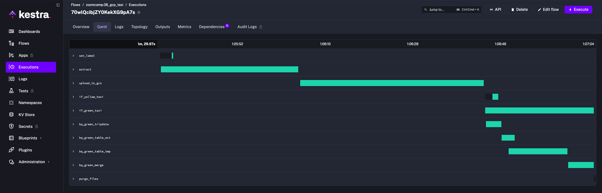
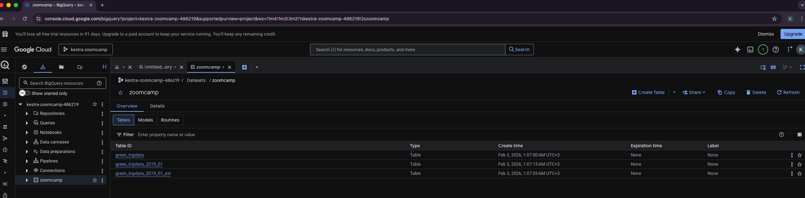
*Caption: Gantt chart showing the successful execution of the full GCP ingestion pipeline, including GCS upload and BigQuery merge tasks.*

# ## 🗓️ Step 15: Automated Scheduling & Cloud Backfills
# This step marks the transition to a fully automated, cloud-native ingestion pipeline using Kestra's scheduling and backfill capabilities.

### 🏗️ Orchestration Strategy:
- **Unified Pipeline:** Implemented `09_gcp_taxi_scheduled.yaml`, a consolidated flow that handles both **Yellow** and **Green** taxi datasets through conditional logic.
- **Dynamic Scheduling:** Configured automated triggers to maintain the data lake:
  - **Green Taxi:** Daily/Monthly at 09:00 UTC.
  - **Yellow Taxi:** Daily/Monthly at 10:00 UTC.
- **Idempotent MERGE Logic:** Integrated a SQL `MERGE` strategy utilizing an MD5-hashed `unique_row_id`. This method ensures that backfilling historical data does not create duplicate records.

### 🔍 Execution & Backfill Validation:
The successful execution via the Backfill UI confirms that the system correctly resolves the `{{trigger.date}}` context and processes the data directly into the Google Cloud environment.


*Caption: Successful execution of the scheduled flow via the Backfill UI, correctly resolving all temporal variables and populating BigQuery.*

---

## 🔄 Final Step: Data Ingestion Summary (Backfill Operations)

To achieve the required row counts for the Module 2 Homework, the following backfill operations were successfully executed using the `09_gcp_taxi_scheduled` flow:

| Dataset | Start Date | End Date | Purpose |
| :--- | :--- | :--- | :--- |
| **Yellow Taxi** | `2020-01-01` | `2020-12-31` | To calculate the total yearly volume for 2020 (Question 3) |
| **Green Taxi** | `2020-01-01` | `2020-12-31` | To calculate the total yearly volume for 2020 (Question 4) |
| **Yellow Taxi** | `2021-01-01` | `2021-07-31` | To isolate the March 2021 partition for specific audit (Question 5) |

### 🛠️ Key Implementation Details:
* **Sequential Execution:** Each backfill was triggered independently to ensure stable resource allocation in the Kestra worker.
* **Resiliency:** The `allow_jagged_rows = TRUE` flag was implemented in the BigQuery external table options to handle malformed CSV lines in the 2021-03 dataset.
* **Data Integrity:** Final counts were verified only after the Kestra UI progress bar reached 100% and all monthly executions transitioned to the `SUCCESS` state.

 ## 🤖 Step 17.22: Detailed AI Integration Guide
 This section documents the integration of Google Gemini AI into Kestra.
 ### 🛠️ Step 2.5.1: Gemini API Provisioning
 Created a unique API Key via Google AI Studio for model interfacing.
 Authenticated through a secure Google account to access the free tier.
 Ensured the key was never committed to public repositories for security.
 ### ⚙️ Step 2.5.2: Infrastructure Configuration
 Updated the docker-compose.yml file to include the Gemini API configuration.
 Added the KESTRA_CONFIGURATION block to define the model and key.
 Used 'models/gemini-1.5-flash' or 'gemini-2.0-flash' as the model-name.
 Injected the API key directly into the YAML for local development activation.
 Restarted services using 'docker compose up -d' to apply the new AI settings.
 ### ✨ Step 2.5.3: AI Copilot Implementation
 Accessed the AI Copilot via the sparkle icon (✨) in the Kestra UI editor.
 Used natural language prompts to generate Extract-Load-Transform (ELT) flows.
 Verified that Copilot uses current Kestra plugin types like 'io.kestra.plugin.gcp'.
 Confirmed the generated YAML follows the latest Kestra property standards.
 ### 🧪 Step 2.5.4: RAG (Retrieval Augmented Generation) Analysis
 Ran '10_chat_without_rag.yaml' to identify potential model hallucinations.
 Executed '11_chat_with_rag.yaml' to provide the LLM with real documentation context.
 Observed that RAG-grounded responses were significantly more accurate and detailed.
 Verified that embeddings were correctly stored and retrieved from the KV Store.
 ### 🔍 Step 2.5.5: Troubleshooting & Quota Management
 Resolved '404 NOT_FOUND' errors by correcting the specific model-name URI.
 Handled '429 RESOURCE_EXHAUSTED' errors by implementing manual wait times.
 Monitored API quotas in Google AI Studio to stay within free tier limits.
 Verified that a 60-second delay allows the API token bucket to refill.


## 🔑 Step 17.24: Securing Credentials via KV Store
Resolving "PebbleException: Key does not exist" by implementing Kestra's internal Key-Value storage.

### 🛠️ Implementation:
- **Namespace Isolation:** Created the `GEMINI_API_KEY` entry specifically within the `zoomcamp` namespace.
- **Dynamic Reference:** Migrated the RAG flow logic from hardcoded strings to dynamic lookups using the `{{ kv(...) }}` function.
- **Security Benefit:** Successfully decoupled sensitive API credentials from the workflow YAML, allowing for safe repository commits.