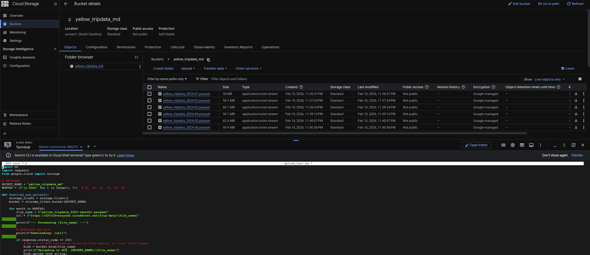
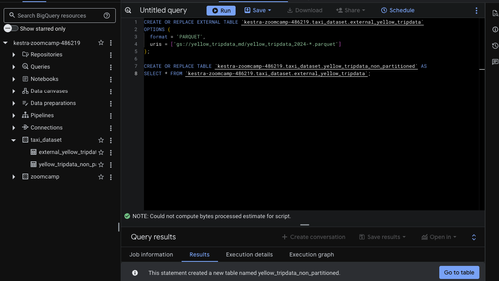
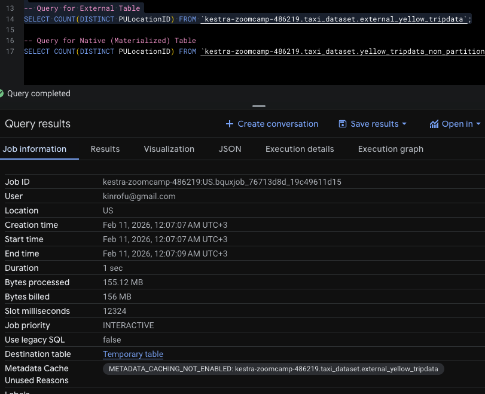
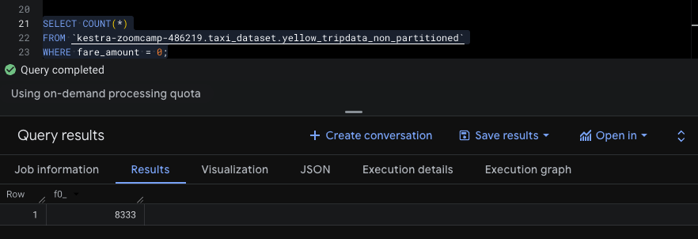
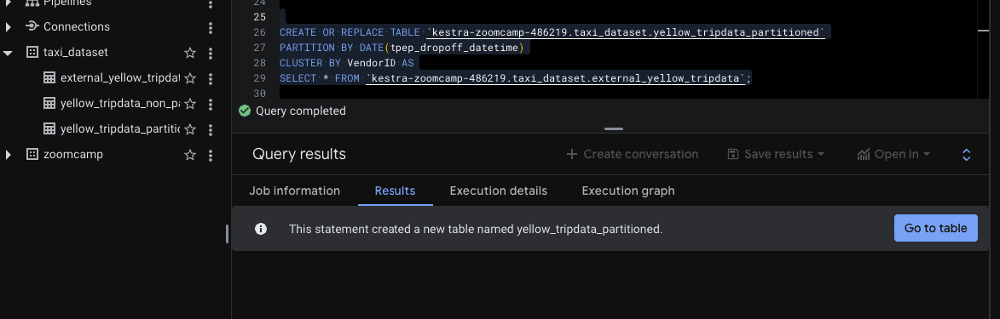
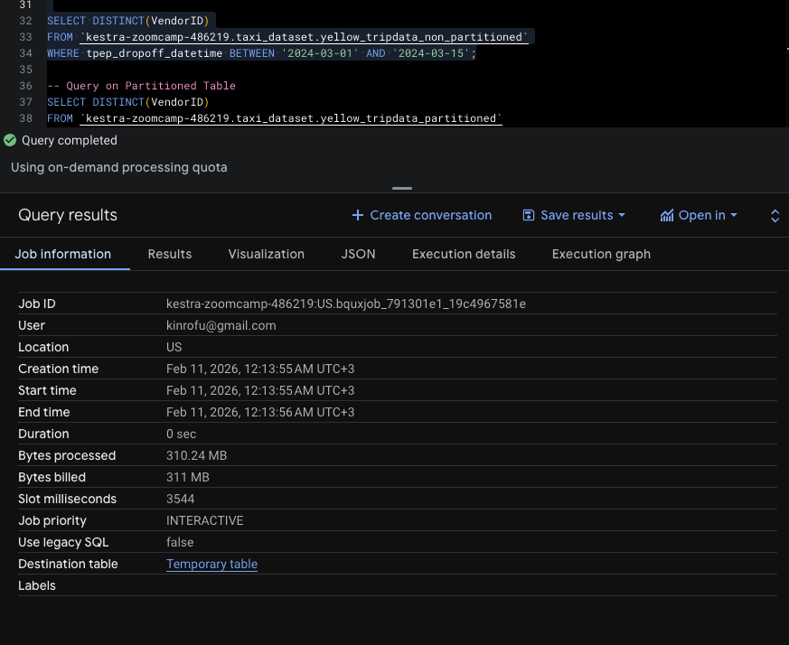
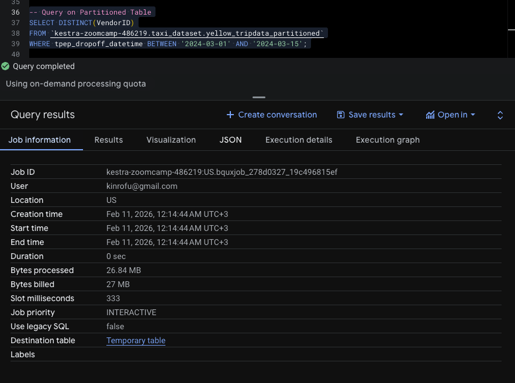

# Data Engineering Zoomcamp 2026 - Module 3: Data Warehousing Homework

This repository contains the solutions for the Module 3 homework of the Data Engineering Zoomcamp. The focus is on BigQuery, Google Cloud Storage (GCS), and optimizing data warehouse performance through partitioning and clustering.

## Dataset
- **Source:** [NYC TLC Trip Record Data](https://www.nyc.gov/site/tlc/about/tlc-trip-record-data.page)
- **Data:** Yellow Taxi Trip Records for January 2024 to June 2024.
- **Format:** Parquet files.

---

## 1. Data Ingestion (Loading to GCS)

In this stage, the taxi data was downloaded from the official NYC TLC website and uploaded to a Google Cloud Storage bucket named `yellow_tripdata_md`.

### Tools Used
- **Google Cloud Shell:** For running the ingestion script in the cloud environment.
- **Python 3:** To handle the download and upload process efficiently.
- **Google Cloud Storage (GCS):** Serving as our data lake.

### Ingestion Script (`upload_taxi.py`)
The following Python script was used to transfer the 6 months of data directly into the GCS bucket:

```python
import os
import requests
from google.cloud import storage

# Configuration
BUCKET_NAME = "yellow_tripdata_md"
MONTHS = [f"{i:02d}" for i in range(1, 7)] # January to June 2024

def download_and_upload():
    storage_client = storage.Client()
    bucket = storage_client.bucket(BUCKET_NAME)

    for month in MONTHS:
        file_name = f"yellow_tripdata_2024-{month}.parquet"
        url = f"[https://d37ci6vzurychx.cloudfront.net/trip-data/](https://d37ci6vzurychx.cloudfront.net/trip-data/){file_name}"
        
        print(f"--- Processing {file_name} ---")
        response = requests.get(url)
        
        if response.status_code == 200:
            blob = bucket.blob(file_name)
            # Uploading directly from memory to GCS
            blob.upload_from_string(response.content, content_type='application/octet-stream')
            print(f"Successfully uploaded: {file_name}\n")
        else:
            print(f"Error: Could not download {file_name}!")

if __name__ == "__main__":
    download_and_upload()
```


## 2. BigQuery Setup

In this section, we create an External Table to link our GCS data to BigQuery and a Native (Regular) Table to store the data internally within BigQuery storage.

### 2.1 Create External Table
This table allows us to query the Parquet files dire sctly from the GCS bucket without importing the data into BigQuery.

```sql
-- Create an external table referring to the GCS path
CREATE OR REPLACE EXTERNAL TABLE `your-project-id.taxi_dataset.external_yellow_tripdata`
OPTIONS (
  format = 'PARQUET',
  




### Question 2: Write a query to count the distinct number of PULocationIDs for the entire dataset on both the tables. What is the estimated amount of data that will be read when this query is executed on the External Table and the Table?

**Queries:**

```sql
-- Query for External Table
SELECT COUNT(DISTINCT PULocationID) FROM `kestra-zoomcamp-486219.taxi_dataset.external_yellow_tripdata`;
```




### Question 3: Write a query to retrieve the PULocationID from the table (not the external table) in BigQuery. Now write a query to retrieve the PULocationID and DOLocationID on the same table. Why are the estimated number of Bytes different?

**Queries for Comparison:**

```sql
-- Query 1: Selecting one column
SELECT PULocationID 
FROM `kestra-zoomcamp-486219.taxi_dataset.yellow_tripdata_non_partitioned`;

-- Query 2: Selecting two columns
SELECT PULocationID, DOLocationID 
FROM `kestra-zoomcamp-486219.taxi_dataset.yellow_tripdata_non_partitioned`;
```


### Question 4: How many records have a fare_amount of 0?

To find this, we run a query filtering by the `fare_amount` column.

```sql
SELECT COUNT(*)
FROM `kestra-zoomcamp-486219.taxi_dataset.yellow_tripdata_non_partitioned`
WHERE fare_amount = 0;
```



### Question 5: What is the best strategy to make an optimized table in Big Query if your query will always filter based on tpep_dropoff_datetime and order the results by VendorID?

**Answer:** Partition by `tpep_dropoff_datetime` and Cluster on `VendorID`.

**SQL to create the optimized table:**
```sql
CREATE OR REPLACE TABLE `kestra-zoomcamp-486219.taxi_dataset.yellow_tripdata_partitioned`
PARTITION BY DATE(tpep_dropoff_datetime)
CLUSTER BY VendorID AS
SELECT * FROM `kestra-zoomcamp-486219.taxi_dataset.external_yellow_tripdata`;
```




### Question 6: Write a query to retrieve the distinct VendorIDs between tpep_dropoff_datetime 2024-03-01 and 2024-03-15 (inclusive). What are the estimated bytes processed for the non-partitioned and partitioned tables?

**Queries for Comparison:**

```sql
-- Query on Non-Partitioned Table
SELECT DISTINCT(VendorID)
FROM `kestra-zoomcamp-486219.taxi_dataset.yellow_tripdata_non_partitioned`
WHERE tpep_dropoff_datetime BETWEEN '2024-03-01' AND '2024-03-15';

-- Query on Partitioned Table
SELECT DISTINCT(VendorID)
FROM `kestra-zoomcamp-486219.taxi_dataset.yellow_tripdata_partitioned`
WHERE tpep_dropoff_datetime BETWEEN '2024-03-01' AND '2024-03-15';

```




### Question 7: Where is the data stored in the External Table you created?
**Answer:** GCP Bucket. (External tables keep the data in its original source, which in our case is Google Cloud Storage).

### Question 8: It is best practice in Big Query to always cluster your data:
**Answer:** False. (Clustering is not always beneficial for small datasets - typically under 1 GB - as it can add metadata overhead without providing significant performance gains).
