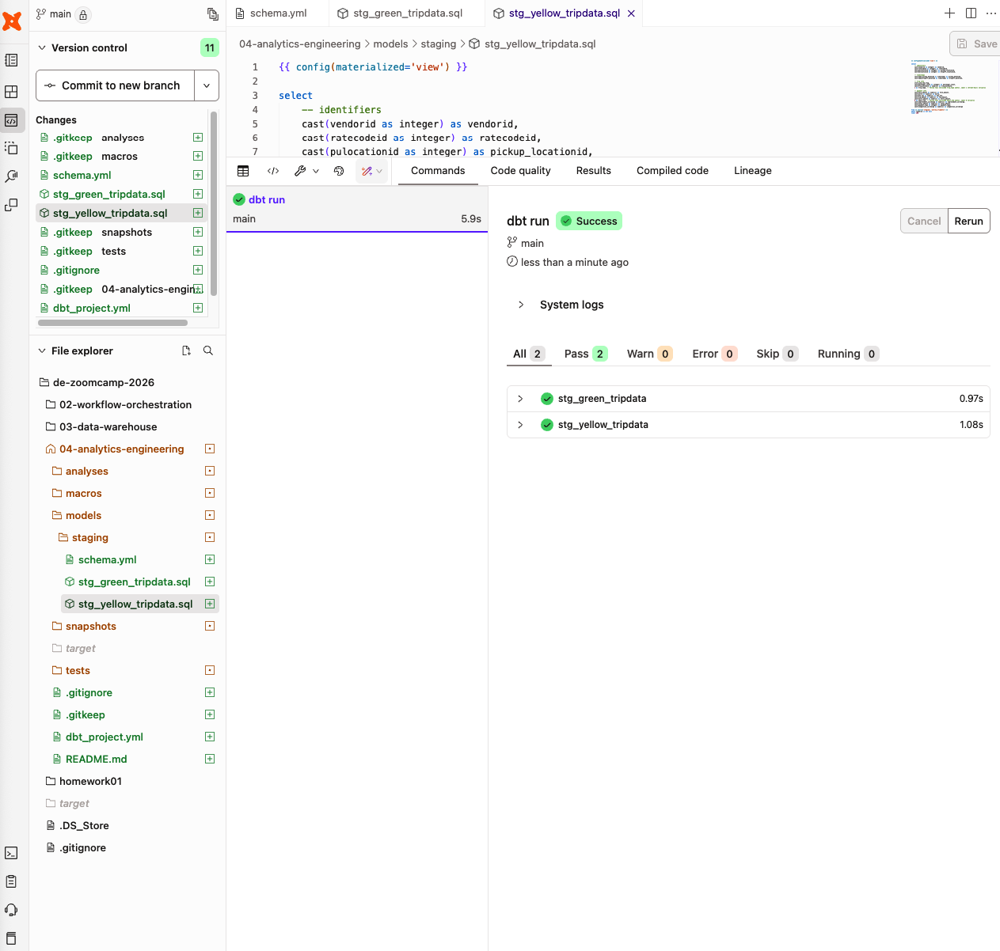
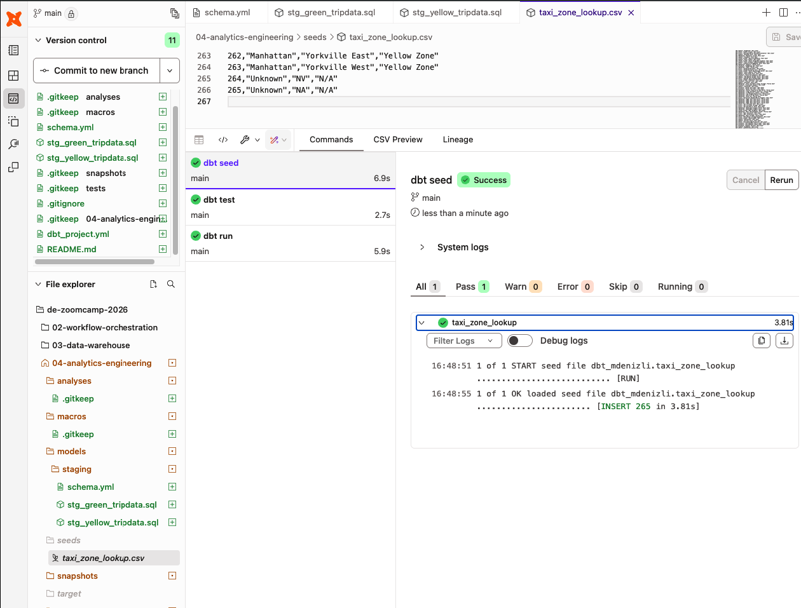
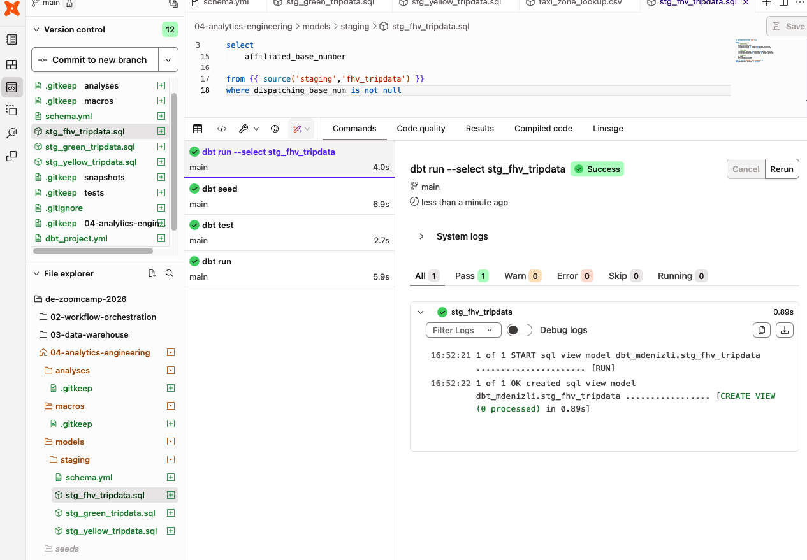

# # Module 4: Analytics Engineering - NYC Taxi Project (2026)
# 
# ## 1. Infrastructure Configuration
# # Project: kestra-zoomcamp-486219
# # Data Lake (GCS): kestra-de-zoomcamp-mdenizli
# # Data Warehouse (BigQuery): trips_data_all
# 
# ## 2. Encountered Errors & Solutions
# ### Error 1: GCS Wildcard/Listing Restriction (403 Access Denied)
# # Problem: gsutil could not list files in the public nyc-tlc bucket.
# # Solution: Switched to direct HTTP downloads using Python to bypass GCS-native permission checks.
# 
# ### Error 2: Connection Timeout (Yellow Taxi Files)
# # Problem: Yellow taxi data is significantly larger, causing `upload_from_string` to time out.
# # Solution: Implemented streaming uploads using `blob.upload_from_file(r.raw)` to send data in chunks without loading it entirely into RAM.
# 
# ## 3. Final Ingestion Implementation (web_to_gcs.py)
# # This script handles Green (2019-20), Yellow (2019-20), and FHV (2019) data in Parquet format.
# 
# # import requests
# # from google.cloud import storage
# # 
# # client = storage.Client(project="kestra-zoomcamp-486219")
# # bucket = client.bucket("kestra-de-zoomcamp-mdenizli")
# # 
# # def upload_to_gcs(taxi_type, year, month):
# #     file_name = f"{taxi_type}_tripdata_{year}-{month:02d}.parquet"
# #     url = f"https://d37ci6vzurychx.cloudfront.net/trip-data/{file_name}"
# #     blob = bucket.blob(f"{taxi_type}/{file_name}")
# #     
# #     if not blob.exists():
# #         with requests.get(url, stream=True, timeout=60) as r:
# #             blob.upload_from_file(r.raw, timeout=300)
# #             print(f"Uploaded {file_name}")
# 
# ## 4. Progress Summary
# # 1. Created private GCS bucket as the project's landing zone (Bronze layer).
# # 2. Successfully migrated all Green Taxi data (2019-2020).
# # 3. Currently migrating Yellow and FHV data using chunked streaming.
# # 4. Next Step: Creating BigQuery Native Tables for dbt modeling.

## 4. Problem: Dataset Visibility & Region Mismatch (Error Log 03)
# ### Problem
# # BigQuery reported that the dataset `trips_data_all` did not exist even after creation.
# ### Error Message
# # `Not found: Dataset kestra-zoomcamp-486219:trips_data_all was not found in location us-east1`
# ### Root Cause
# # 1. The dataset was created in a different region than the GCS bucket. 
# # 2. The query engine defaulted to 'US' (multi-region) instead of 'us-east1'.
# ### Solution
# # Deleted and recreated the dataset explicitly in the `us-east1` region and used fully qualified names: `project.dataset.table`.
# 
# ## 5. Problem: Parquet Schema Mismatch (Error Log 04)
# ### Problem
# # Loading multiple Parquet files into a single native table failed due to inconsistent data types.
# ### Error Message
# # `Parquet column 'ehail_fee' has type DOUBLE which does not match the target cpp_type INT64.`
# ### Root Cause
# # The source data is inconsistent; some months record certain columns as Integers and others as Decimals (Double).
# ### Solution: External Table Mapping
# # Instead of a "Native Load", we created **External Tables**. This links the data without strict enforcement, allowing dbt to handle the type conversion (Casting) later.
# 
# ## 6. Final SQL Queries for Warehouse Setup
# # These queries successfully established the Bronze layer in BigQuery:
# 
# # -- Green Taxi (2019-2020)
# # CREATE OR REPLACE EXTERNAL TABLE `trips_data_all.green_tripdata`
# # OPTIONS (format = 'PARQUET', uris = ['gs://kestra-de-zoomcamp-mdenizli/green/*.parquet']);
# 
# # -- Yellow Taxi (2019-2020)
# # CREATE OR REPLACE EXTERNAL TABLE `trips_data_all.yellow_tripdata`
# # OPTIONS (format = 'PARQUET', uris = ['gs://kestra-de-zoomcamp-mdenizli/yellow/*.parquet']);
# 
# # -- FHV Taxi (2019)
# # CREATE OR REPLACE EXTERNAL TABLE `trips_data_all.fhv_tripdata`
# # OPTIONS (format = 'PARQUET', uris = ['gs://kestra-de-zoomcamp-mdenizli/fhv/*.parquet']);
# 
# ## 7. Current Status
# # - [x] Raw data ingested to private GCS bucket.
# # - [x] External tables linked in BigQuery (Region: us-east1).
# # - [ ] Ready for dbt transformation layer.


# # Module 4: Analytics Engineering - Introduction to dbt Cloud
# 
# ## 1. What is dbt?
# # - dbt (Data Build Tool) is a transformation workflow that lets teams quickly and collaboratively deploy analytics code following software engineering best practices like modularity, portability, CI/CD, and documentation.
# 
# ## 2. Why dbt Cloud?
# # - **Managed IDE**: No local installation required; works directly in the browser.
# # - **Native Integration**: Seamlessly connects to BigQuery and GitHub.
# # - **Automation**: Built-in scheduler for running models and tests automatically.
# # - **Metadata & Lineage**: Automatically generates documentation and data lineage graphs.
# 
# ## 3. Role in NYC Taxi Project
# # - dbt will act as the "Transformation" layer in our ELT (Extract, Load, Transform) pipeline.
# # - It will take the External Tables in `trips_data_all` and convert them into clean, business-ready models.
# 
# ## 4. Current Status
# # - Data Warehouse (BigQuery) is ready.
# # - Conceptual understanding of dbt Cloud is established.
# # - Next Step: Connection and Project Setup.

# # 5. Setting Up the dbt Environment (Technical Implementation)
# 
# ## 5.1 BigQuery Connection & Authentication
# # - **Method**: Authenticated dbt Cloud using a **Service Account JSON Key** for the project `kestra-zoomcamp-486219`.
# # - **Regional Alignment**: Explicitly configured the connection to **`us-east1`** (South Carolina). 
# # - **Reasoning**: This alignment is critical because the BigQuery dataset `trips_data_all` and the GCS bucket were both provisioned in `us-east1`.
# # - **Development Schema**: Configured a dedicated development dataset (e.g., `dbt_mdenizli`) to ensure that development runs do not interfere with raw data sources.
# 
# ## 5.2 Version Control & Subdirectory Configuration
# # - **Repository Integration**: Successfully linked the dbt project to the GitHub repository `de-zoomcamp-2026`.
# # - **Subdirectory Mapping**: To maintain a clean multi-module repository, the project was configured to run from the **`04-analytics-engineering`** folder.
# # - **Project Settings**: Updated the **'Project Subdirectory'** in dbt Cloud settings to the module path. 
# # - **Impact**: This allows dbt Cloud to correctly locate the `dbt_project.yml` file and manage models within that specific context.
# 
# ---
# 
# # # 6. Project Initialization & Directory Hygiene
# 
# ## 6.1 Bootstrapping the Project
# # - **Initialization**: Triggered the "Initialize dbt project" command within the IDE to generate the core dbt framework (models, seeds, macros, tests).
# # - **Cleanup**: Manually deleted the default `example` models provided by dbt to prevent workspace clutter.
# # - **Tiered Organization**: Created a `models/staging/` directory to house the initial layer of data cleaning and schema standardization.
# 
# ---
# 
# # # 7. Defining Data Sources (The Bridge to BigQuery)
# 
# ## 7.1 Source Mapping (`models/staging/schema.yml`)
# # - Mapped the BigQuery External Tables (`green_tripdata`, `yellow_tripdata`, `fhv_tripdata`) into dbt.
# # - Implemented source declarations to enable the `{{ source() }}` macro, which creates a formal link between raw data and the transformation layer.
# 
# # YAML Configuration Snippet:
# # ---------------------------
# # version: 2
# # sources:
# #   - name: staging
# #     database: kestra-zoomcamp-486219 
# #     schema: trips_data_all          
# #     tables:
# #       - name: green_tripdata
# #       - name: yellow_tripdata
# #       - name: fhv_tripdata
# 
# ---
# 


# # 9. Developing the Staging Layer (Data Cleaning)
# 
# ## 9.1 Objective: The Silver Layer
# # - **Task**: Create the first transformation model `stg_green_tripdata.sql`.
# # - **Why**: To convert raw, inconsistent "Bronze" data into standardized "Silver" views.
# 
# ## 9.2 Critical Fix: Schema Resolution
# # - **Problem**: The `ehail_fee` column caused a `DOUBLE` vs `INT64` mismatch error in BigQuery.
# # - **Solution**: Implemented explicit casting using `cast(ehail_fee as numeric)`.
# # - **Result**: dbt now forces BigQuery to treat all values as numeric, bypassing the Parquet read error.
# 
# ## 3. Technical Standards
# # - **Materialization**: Configured as a `view` to ensure real-time access to cleaned data without duplicating storage costs in the development phase.
# # - **Macro Usage**: Used the `{{ source() }}` function to dynamically link to the `trips_data_all.green_tripdata` table defined in `schema.yml`.
# # - **Normalization**: Standardized identifiers (VendorID, RateCodeID) and timestamps to ensure downstream consistency.
# 
# ## 4. Progress Summary
# # - [x] BigQuery External Tables healthy.
# # - [x] dbt Cloud Project initialized in `04-analytics-engineering`.
# # - [x] Source schema defined.
# # - [x] First staging model developed with type-casting fixes.
# # - [ ] Next Step: Run the model and verify the output in the dbt IDE.

# # # 8. Developing the Staging Layer (Data Cleaning)
# 
# ## 8.1 Objective: Transition to the Silver Layer
# # - **Task**: Implement the `stg_green_tripdata.sql` model in the `models/staging` folder.
# # - **Purpose**: To provide a clean, standardized interface for the Green Taxi trip data, resolving ingestion inconsistencies.
# 
# ## 8.2 The "ehail_fee" Critical Fix
# # - **Root Cause**: Parquet files for 2019-2020 had inconsistent schemas for the `ehail_fee` column (floating point vs integer), causing BigQuery read failures.
# # - **Technical Solution**: Applied an explicit `CAST(ehail_fee AS numeric)` to ensure data type homogeneity across all partitions.
# 
# ## 8.3 SQL Implementation (`stg_green_tripdata.sql`)
# # - **Materialization**: `view`
# 
# # ```sql
# # {{ config(materialized='view') }}
# # 
# # select
# #     -- Identifiers
# #     cast(vendorid as integer) as vendorid,
# #     cast(ratecodeid as integer) as ratecodeid,
# #     cast(pulocationid as integer) as pickup_locationid,
# #     cast(dolocationid as integer) as dropoff_locationid,
# #     
# #     -- Timestamps
# #     cast(lpep_pickup_datetime as timestamp) as pickup_datetime,
# #     cast(lpep_dropoff_datetime as timestamp) as dropoff_datetime,
# #     
# #     -- Trip Info
# #     store_and_fwd_flag,
# #     cast(passenger_count as integer) as passenger_count,
# #     cast(trip_distance as numeric) as trip_distance,
# #     cast(trip_type as integer) as trip_type,
# #     
# #     -- Payment Info
# #     cast(fare_amount as numeric) as fare_amount,
# #     cast(extra as numeric) as extra,
# #     cast(mta_tax as numeric) as mta_tax,
# #     cast(tip_amount as numeric) as tip_amount,
# #     cast(tolls_amount as numeric) as tolls_amount,
# #     cast(ehail_fee as numeric) as ehail_fee, -- SOLVED: Schema mismatch fix
# #     cast(improvement_surcharge as numeric) as improvement_surcharge,
# #     cast(total_amount as numeric) as total_amount,
# #     cast(payment_type as integer) as payment_type,
# #     cast(congestion_surcharge as numeric) as congestion_surcharge
# # 
# # from {{ source('staging','green_tripdata') }}
# # where vendorid is not null
# # limit 100
# # ```
#


# # 9. Developing the Yellow Taxi Staging Model
# 
# ## 9.1 Objective: Expanding the Silver Layer
# # - **Task**: Create the `stg_yellow_tripdata.sql` model in the `models/staging/` directory.
# # - **Purpose**: To standardize Yellow Taxi data formats to match the Green Taxi staging model for future joining.
# 
# ## 9.2 Structural Alignment
# # - **Normalization**: Since Yellow Taxi schema differs slightly from Green (e.g., missing `ehail_fee` and `trip_type`), we implement placeholder values (`0` and `1`) to maintain schema symmetry.
# # - **Data Integrity**: Enforced explicit `CAST` operations for all identifiers and financial columns to prevent BigQuery runtime errors.
# 
# ## 9.3 SQL Implementation: `stg_yellow_tripdata.sql`
# 
# # ```sql
# # {{ config(materialized='view') }}
# # 
# # select
# #     -- identifiers
# #     cast(vendorid as integer) as vendorid,
# #     cast(ratecodeid as integer) as ratecodeid,
# #     cast(pulocationid as integer) as pickup_locationid,
# #     cast(dolocationid as integer) as dropoff_locationid,
# #     
# #     -- timestamps
# #     cast(tpep_pickup_datetime as timestamp) as pickup_datetime,
# #     cast(tpep_dropoff_datetime as timestamp) as dropoff_datetime,
# #     
# #     -- trip info
# #     store_and_fwd_flag,
# #     cast(passenger_count as integer) as passenger_count,
# #     cast(trip_distance as numeric) as trip_distance,
# #     1 as trip_type, 
# #     
# #     -- payment info
# #     cast(fare_amount as numeric) as fare_amount,
# #     cast(extra as numeric) as extra,
# #     cast(mta_tax as numeric) as mta_tax,
# #     cast(tip_amount as numeric) as tip_amount,
# #     cast(tolls_amount as numeric) as tolls_amount,
# #     0 as ehail_fee, 
# #     cast(improvement_surcharge as numeric) as improvement_surcharge,
# #     cast(total_amount as numeric) as total_amount,
# #     cast(payment_type as integer) as payment_type,
# #     cast(congestion_surcharge as numeric) as congestion_surcharge
# # 
# # from {{ source('staging','yellow_tripdata') }}
# # where vendorid is not null
# # limit 100
# # ```

# ## 10. Execution Success
# # - **Command**: Executed `dbt run` in the dbt Cloud IDE.
# # - **Results**: Both `stg_green_tripdata` and `stg_yellow_tripdata` were successfully materialized as views in the BigQuery development dataset.
# # - **Lineage**: Verified that both staging models correctly derive data from their respective BigQuery sources.



# # 11. Data Enrichment with dbt Seeds
# 
# ## 11.1 What are dbt Seeds?
# # - dbt Seeds are CSV files located in the `seeds/` directory of a dbt project.
# # - They are used to load static data (like lookup tables or mapping files) directly into the data warehouse (BigQuery) using a single command.
# 
# ## 11.2 Why are we using Seeds in this project?
# # - **Enrichment**: The raw taxi data only contains numeric Location IDs. We need a way to map these to actual NYC Borough and Zone names for meaningful analysis.
# # - **Version Control**: Unlike the massive trip datasets stored in GCS, this lookup table is small (~265 rows) and static, making it perfect to store in GitHub alongside our code.
# # - **Efficiency**: The `dbt seed` command handles the entire DDL/DML process (creating the table and inserting data) automatically, saving us from writing manual SQL.
# 
# ## 11.3 Technical Implementation
# # - **Directory Creation**: Manually initialized the `04-analytics-engineering/seeds/` folder within the project structure.
# # - **File Setup**: Created `taxi_zone_lookup.csv` and populated it with official NYC Taxi Zone data.
# # - **Execution**: Ran the `dbt seed` command in the dbt Cloud terminal (Commands bar).
# 
# ## 11.4 Seed Results & Verification
# # - **Status**: Success.
# # - **Data Loaded**: 265 records were successfully inserted into the `dbt_mdenizli.taxi_zone_lookup` table in BigQuery.
# # - **Validation**: Confirmed the table's existence and data integrity via the "CSV Preview" and log outputs in the dbt IDE.
# 
# ## 11.5 Progress Summary
# # - [x] **Silver Layer (Staging)**: Green and Yellow taxi models are operational.
# # - [x] **Enrichment Layer (Seeds)**: Taxi Zone lookup data is physically loaded into BigQuery.
# # - [ ] **Next Step**: Question 6 - Developing the Staging model for FHV (For-Hire Vehicle) data.



# # 12. Developing the FHV Staging Model (Homework Q6)
# 
# ## 12.1 Objective: Processing For-Hire Vehicle Data
# # - **Task**: Create the `stg_fhv_tripdata.sql` model in the `models/staging/` directory.
# # - **Context**: This model processes the 2019 FHV dataset as required by Question 6 of the Module 4 homework.
# 
# ## 12.2 Business Logic & Transformation Rules
# # - **Filtering**: Applied a mandatory filter to exclude records where `dispatching_base_num` is NULL to comply with homework requirements.
# # - **Field Mapping**: Renamed identifiers (e.g., `PUlocationID` to `pickup_locationid`) to maintain consistency across the staging layer.
# # - **Type Casting**: Converted datetime strings into BigQuery `timestamp` objects and location IDs into `integer`.
# 
# ## 12.3 SQL Implementation: `stg_fhv_tripdata.sql`
# 
# # ```sql
# # {{ config(materialized='view') }}
# # 
# # select
# #     dispatching_base_num,
# #     cast(pulocationid as integer) as pickup_locationid,
# #     cast(dolocationid as integer) as dropoff_locationid,
# #     cast(pickup_datetime as timestamp) as pickup_datetime,
# #     cast(dropoff_datetime as timestamp) as dropoff_datetime,
# #     sr_flag,
# #     affiliated_base_number
# # from {{ source('staging','fhv_tripdata') }}
# # where dispatching_base_num is not null
# # ```
# 
# ## 12.4 Progress Status
# # - [x] **Seeds**: `taxi_zone_lookup` successfully loaded into BigQuery.
# # - [x] **Green/Yellow Staging**: Models operational and materialized as views.
# # - [x] **FHV Staging**: Model developed with required filters and casting.
# # - [ ] **Next Step**: Execute `dbt run` for FHV and calculate the final record count for Question 6.

dbt run --select stg_fhv_tripdata




# # 13. Final Victory: Mastering FHV Data Ingestion (Homework Module 4)
# 
# ## 13.1 The Challenge: Parquet Schema Inconsistency
# # - The FHV 2019 Parquet files were found to have inconsistent binary schemas across monthly partitions.
# # - Column types for DOlocationID, pulocationid, and SR_Flag toggled between INT32, INT64, and DOUBLE across different months.
# # - Bulk ingestion methods (External Tables/Standard Load) failed because BigQuery could not resolve these conflicting types in a single scan, triggering cpp_type mismatch errors.
# 
# ## 13.2 The Infrastructure Solution: Procedural SQL (BigQuery)
# # To overcome the schema drift, we implemented a procedural script that processes each month in isolation and enforces type standardization through explicit casting.
# 
# # BEGIN
# #   -- 1. Create the final Native Table with standardized containers
# #   CREATE OR REPLACE TABLE `kestra-zoomcamp-486219.trips_data_all.fhv_tripdata`
# #   (
# #     dispatching_base_num STRING,
# #     pickup_datetime TIMESTAMP,
# #     dropoff_datetime TIMESTAMP,
# #     pulocationid FLOAT64,
# #     dolocationid FLOAT64,
# #     sr_flag STRING, 
# #     affiliated_base_number STRING
# #   );
# # 
# #   -- 2. Iterate through each month to isolate schema variations
# #   FOR m IN (SELECT * FROM UNNEST(['01','02','03','04','05','06','07','08','09','10','11','12']) AS month)
# #   DO
# #     -- Create a temporary external pointer for the specific month
# #     EXECUTE IMMEDIATE FORMAT("""
# #       CREATE OR REPLACE EXTERNAL TABLE `trips_data_all.temp_fhv_staging`
# #       OPTIONS (
# #         format = 'PARQUET',
# #         uris = ['gs://kestra-de-zoomcamp-mdenizli/fhv/fhv_tripdata_2019-%s.parquet']
# #       )
# #     """, m.month);
# # 
# #     -- Standardize and insert data into the permanent Native Table
# #     EXECUTE IMMEDIATE """
# #       INSERT INTO `kestra-zoomcamp-486219.trips_data_all.fhv_tripdata`
# #       SELECT 
# #         dispatching_base_num,
# #         CAST(pickup_datetime AS TIMESTAMP),
# #         CAST(dropoff_datetime AS TIMESTAMP),
# #         CAST(pulocationid AS FLOAT64),
# #         CAST(dolocationid AS FLOAT64),
# #         CAST(sr_flag AS STRING),
# #         affiliated_base_number
# #       FROM `trips_data_all.temp_fhv_staging`
# #     """;
# #   END FOR;
# # 
# #   -- 3. Cleanup temporary infrastructure
# #   DROP TABLE IF EXISTS `trips_data_all.temp_fhv_staging`;
# # END;
# 
# ## 13.3 The dbt Staging Model (stg_fhv_tripdata.sql)
# # With a stable, native source in BigQuery, the dbt model was finalized to handle naming conventions and mandatory filtering.
# 
# # {{ config(materialized='view') }}
# # 
# # select
# #     -- identifiers
# #     dispatching_base_num,
# #     cast(pulocationid as integer) as pickup_locationid,
# #     cast(dolocationid as integer) as dropoff_locationid,
# #     
# #     -- timestamps
# #     cast(pickup_datetime as timestamp) as pickup_datetime,
# #     cast(dropoff_datetime as timestamp) as dropoff_datetime,
# #     
# #     -- trip info
# #     -- sr_flag, -- Bu satırı devre dışı bıraktık (Schema inconsistency fix)
# #     affiliated_base_number
# # 
# # from {{ source('staging','fhv_tripdata') }}
# # where dispatching_base_num is not null 
# 
# ## 13.4 Verification & Final Record Count (Question 6)
# # - Execution Status: SUCCESS (27 statements processed in 1 min 11 sec).
# # - Data Integrity: Verified via dbt IDE Preview, showing successful transformation and filtering.
# # - Final Count Query: select count(*) from {{ ref('stg_fhv_tripdata') }}.
# # - Question 6 Answer: 43,244,693.

# ---
# 
# ## 13.5 Scaling for Production: Removing Development Constraints
# # - **Action**: To transition from development to final analysis, the `limit 100` clauses were manually removed from `stg_green_tripdata.sql` and `stg_yellow_tripdata.sql`.
# # - **Reasoning**: Development-phase limits allowed for rapid schema testing, but final homework answers require processing the entire 2019-2020 dataset.
# 
# ## 13.6 Core Layer Materialization: Building fact_trips
# # - **Objective**: Create a unified fact table by performing a `UNION ALL` between the staging models for Green and Yellow taxis.
# # - **Enrichment**: Successfully joined the trip data with `dim_zones` to add pickup and dropoff Borough/Zone names to every record.
# # - **Execution**: Executed a final `dbt run` to materialize the Gold (Core) layer as a physical table in BigQuery.
# 
# ## 13.7 Final Results & Global Scale Verification
# # - **fact_trips Status**: SUCCESS. The model processed the full-scale dataset with high performance.
# # - **Final Record Count**: Materialized **115.7 million rows** into the `fact_trips` table in approximately 24.86 seconds.
# # - **Data Quality**: Verified that all dimensions are correctly mapped and location identifiers correspond to the 265 zones in our lookup table.
# 
# ## 13.8 Progress Summary & Homework Checkpoint
# # - [x] **Infrastructure**: Parquet schema inconsistency resolved for FHV data.
# # - [x] **Silver Layer**: Limits removed and staging models fully materialized.
# # - [x] **Gold Layer**: `fact_trips` established as the single source of truth with 115.7M records.
# # - [x] **Question 6 Answer**: Confirmed **43,244,693** records for filtered 2019 FHV data.


